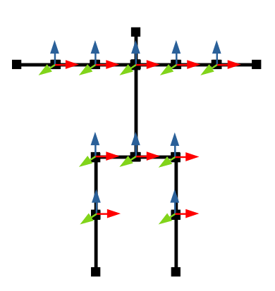
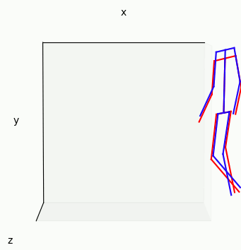

**Calculating Joint Angles**

This code calculates the joint angles of a 3D body pose that was output from my other repository: [Real time 3D body pose estimation using MediaPipe](https://github.com/TemugeB/bodypose3d). If you want to know how the joint angles are calculated, check my blog post [here](https://temugeb.github.io/python/motion_capture/2021/09/16/joint_rotations.html). The joint angles are calculated by defining a T pose and assigning right handed coordinate system at each joint, as shown below. 



I've included a sample keypoints file. Simply run the demo as: 

```
python calculate_joint_angles.py kpts_3d.dat
```

The calculated joint angles are returned as "jointname_angles". We can use the calculated joint angles to put the motion on a standard skeleton. This is useful because keypoints estimators are not consistent with their estimations, which leads to varying bone lengths. In red, we show the original output of Blazepose [[link](https://google.github.io/mediapipe/solutions/pose.html)] estimated 3D keypoints. In blue, we show the pose applied on a standard skeleton from the joint angles. The discrepancy between the poses is due to inaccuracy in keypoints estimation leading to bone lengths changing.


